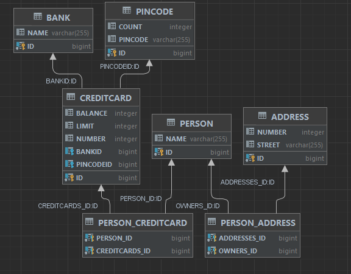

# Short report

## Technical Problems:
I got an error with COUNT not being in a table (or 
something similar, I can't quite remember),
but I realized I forgot to specify in persistence.xml 
file to have a value here:

<property name="javax.persistence.jdbc.url"
value="jdbc:derby:C:\Users\Olesy\simpleDb;create=true"/>.

When I added this the problem went away. 

I also had a minor issue with the test not passing
when it came to is(Set.of(person)), but that was because
I defined the owners set wrong, I wrote Collections<Person> = new HashSet<>()
instead of Set<Person> owners = new HashSet<>().

Last issue I had was actually to inspect database. I did everything correctly,
but I didn't get anything up in the database and I didn't understand why. Then
by a mistake I hit "refresh" button and everything showed itself! So that was
quite funny.

#
## Link to the project:
https://github.com/oap0707/dat250-jpa-example

#
## Explanation of database inspection:
Did it by downloading IntelliJ Ultimate, open project and then go to 
view -> tool windows -> database. There I clicked the + sign and chose data 
source to be apache derby. After that wrote the path to my simpleDB, user
and password which I set to be test and pressed OK. I had to hit refresh after
this to get the tables up. Right click TEST -> diagrams -> show visualization.

#
## Any pending issues:
None.

